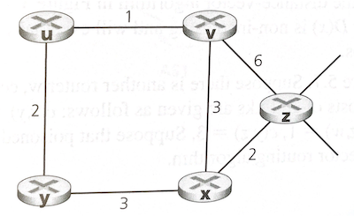

# Homework 9 (Network Layer)

## Concepts
- CIDR Addressing and Subnetting
- IP Fragmentation
- Link State Routing
- Distance Vector Routing

## Q1
Consider a router that interconnects 3 subnets: subnet1, subnet2 and subnet3. Suppose all of the interfaces in each these three subnets are required to have the prefix 223.1.17/24. Write down the "network" address of each subnet (of the form a.b.c.d/x) so that: (1) subnet1 supports at least 60 hosts; (2) subnet2 supports at least 90 hosts; and (3) subnet3 supports at least 12 hosts.

- Subnet1: 223.1.17.0/25; Subnet2: 223.1.17.128/26; Subnet3: 223.1.17.192/26

## Q2
Consider a subnet with prefix 128.119.40.128/26. Give an example of one IP address in dotted-quad-notation (xxx.xxx.xxx.xxx) that can be assigned to this network. If an ISP owns the block of addresses of the form 128.119.40.64/26, and it wants to create 4 subnets from this block, where each block having the same number of hosts. What are the prefixes (of the form a.b.c.d/x) for the 4 subnets?

- it could be 128.119.40.128

- 128.119.40.64/28; 128.119.40.80/28; 128.119.40.96/28; 128.119.40.112/28

## Q3
Consider sending a 2400-byte datagram into a link that has an MTU of 700 bytes. Suppose the original datagram is stamped with an ID=422. How many fragments are generated? What are the values in each IP headers (i.e., ID, frag-flag, offset, and length)?

- (2400‐20)/680 = 4
  
- First three fragments = 700 bytes, the last datagram = 360 bytes. The offset = 0, 85, 170, 255 respectively. The frag-flag of first 3 fragments = 1, the last fragment bit flag = 0.

## Q4:
Consider the following network. With the indicated link costs, use Dijkstra's shortest-path-algorithm to compute the shortest path from x to all network nodes. Show all your steps.

By Dijkstra's Algorithm:

Step  N’         D(x),p(x)  D(u),p(u)  D(v),p(v)   D(w),p(w)   D(y),p(y)   D(z),p(z)
0     t              ∞          2,t        4,t          ∞          7,t          ∞
1     tu             ∞          2,t        4,t         5,u         7,t          ∞
2     tuv           7,v         2,t        4,t         5,u         7,t          ∞
3     tuvw          7,v         2,t        4,t         5,u         7,t          ∞
4     tuvwx         7,v         2,t        4,t         5,u         7,t        15,x
5     tuvwxy        7,v         2,t        4,t         5,u         7,t        15,x
6     tuvwxyz       7,v         2,t        4,t         5,u         7,t        15,x

## Q5:
Consider the network shown below, and assume that each node initially knows the costs to each of its neighbours. Consider the distance-vector algorithm and show the distance table entries at node z.

src\dest U V X Y Z
V        1 0 3 3 5
X        4 3 0 3 2
Y        2 3 3 0 5
Z        6 5 2 5 0

